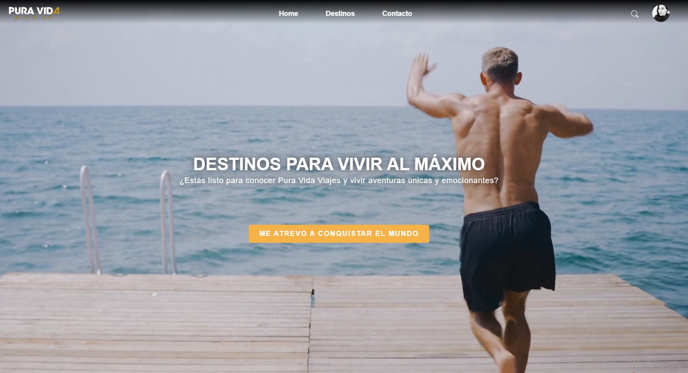
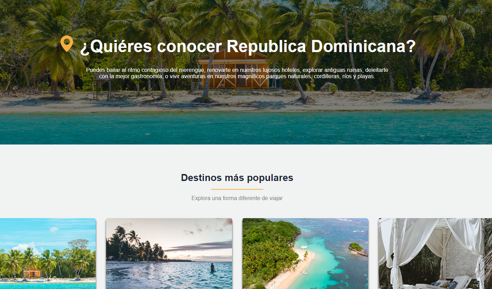
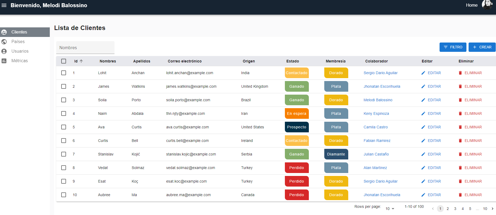
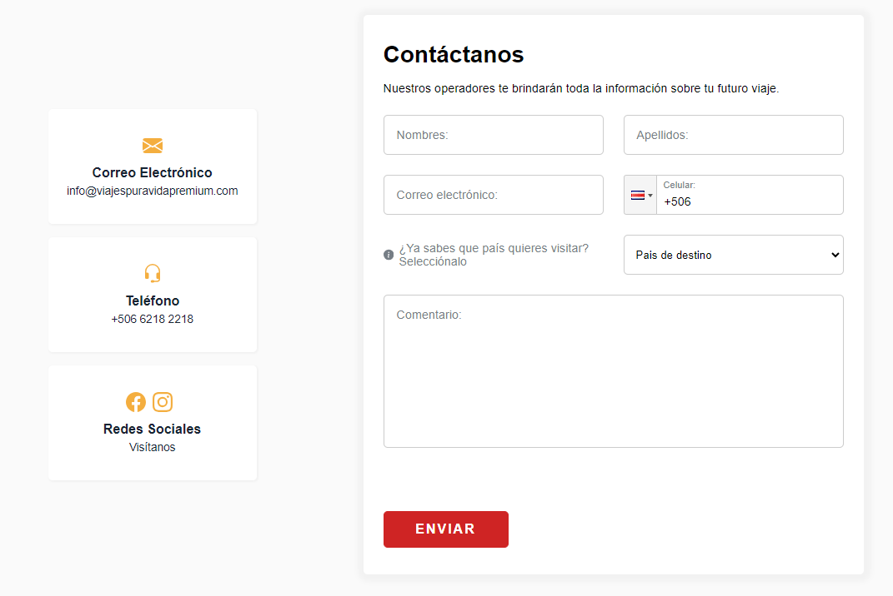

 
  
 
 
 
 
 
 

# **🗺️ MVP para la empresa Pura Vida Viajes**
 

## 🔗 Deploy:
https://client-puravidas-projects.vercel.app/
   

## 🔗 Demo en YouTube:
https://youtu.be/05tl_rTLVtc?si=bHiXhfitxw_CzRae
   

## 💻 Tareas:
-Participar activamente en el diseño UI en Figma, asegurando que la interfaz de usuario sea intuitiva y amigable.
   
-Trabajar en el equipo de Front-end, implementando una variedad de funcionalidades clave en una aplicación que enlaza clientes con expertos en viajes para la personalización de planes, así como en la creación de un dashboard administrativo eficiente.
   
-Colaborar estrechamente con los equipos de Front-end y Back-end, organizándonos en reuniones diarias dirigidas por un Scrum Master. Resolvimos desafíos técnicos, evaluamos nuevas tecnologías y distribuimos las tareas efectivamente. Completamos 3 Sprints de desarrollo con revisiones periódicas junto al Product Owner.
   

## 🛠️ Herramientas implementadas: 

**Front End:**
  - HTML5
  - CSS Modules
  - JavaScript
  - React - Vite
  - Redux toolkit
  - React-admin
  - Material UI
  - API Places Google
  - React Paginate
  - Sweeper y SweetAlert

  

**Back End:**
  - NodeJS
  - Express
  - Sequelize
  - Nodemailer
  - Auth0
  - Paypal

  

**DBMS:**
  - MySQL

  

**Gestión:**
  - Metologías ágiles - Scrum
  - Github flow
  - Trello
  - Slack
  - Discord

  

    

  

## 🔗 Historial de mi trabajo aquí:
https://github.com/puravidaviajespremium/CLIENT
   

## 📧 Contacto:
¿Tienes un proyecto en mente o simplemente quieres charlar sobre tecnología? ¡Hablemos de cómo podemos ayudarnos mutuamente a crecer y a innovar!. Conectémonos y hagamos que las cosas sucedan! Puedes escribirme a melodibalossino@gmail.com o seguirme en [LinkedIn](https://www.linkedin.com/in/melody-balossino-26745021b).

